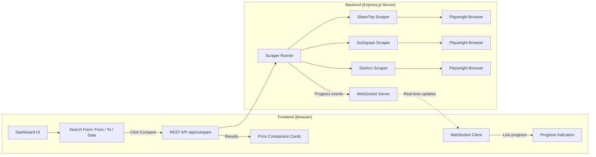

# Flight Price Comparison Tool — Revised Plan (v3)

## What Changed from v2

| Aspect | v2 (Old) | v3 (Revised) |
|---|---|---|
| **Interface** | CLI command-line | ✅ **Web dashboard** with beautiful UI |
| **User experience** | User sees terminal output | ✅ User sees only the **comparison results** — scraping is invisible |
| **Input method** | CLI flags (`--from DAC --to CXB`) | ✅ **3 input fields** on the dashboard: From, To, Date |
| **Backend** | Direct script execution | ✅ **Express.js server** runs scrapers in background |
| **Progress** | Terminal logs | ✅ **Real-time progress bar** via WebSocket |

---

## Architecture



### How It Works (User's Perspective)

1. User opens `http://localhost:3000` in their browser
2. Sees a clean, premium dashboard with **3 input fields**:
   - **From** — Origin airport (dropdown/autocomplete, e.g., "Dhaka (DAC)")
   - **To** — Destination airport (dropdown/autocomplete, e.g., "Cox's Bazar (CXB)")
   - **Date** — Travel date picker
3. Clicks **"Compare Prices"**
4. Sees a **loading animation** with real-time progress:
   - "Searching ShareTrip..." ✓
   - "Searching GoZayaan..." ✓
   - "Searching Shohoz..." ✓
5. Results appear as **comparison cards** — one card per flight, showing price breakdown from all 3 platforms side-by-side
6. The cheapest option is **highlighted**

### What Happens Behind the Scenes (Invisible to User)

- Express server receives the search request
- Launches 3 Playwright headless browsers in parallel
- Each browser: logs in → searches → clicks a flight → reads booking page prices → extracts bKash discount
- Results are normalized, matched by flight number, and sent back to the frontend
- All browser windows close automatically

---

## Folder Structure

```
Air Price Analysis/
├── package.json
├── .env                        # Credentials (git-ignored)
├── .env.example                # Template
├── .gitignore
├── server.js                   # Express + WebSocket server (entry point)
├── public/                     # Frontend (served statically)
│   ├── index.html              # Dashboard page
│   ├── css/
│   │   └── styles.css          # All styling
│   └── js/
│       └── app.js              # Frontend logic (form, API calls, rendering)
├── src/
│   ├── scrapers/
│   │   ├── sharetrip.js        # ShareTrip scraper
│   │   ├── gozayaan.js         # GoZayaan scraper
│   │   └── shohoz.js           # Shohoz scraper
│   ├── runner.js               # Orchestrates all 3 scrapers in parallel
│   ├── compare.js              # Normalizes & matches flights across platforms
│   └── config.js               # Airport data, coupon codes, timeouts
└── results/                    # CSV/JSON exports (auto-generated)
```

---

## Proposed Changes

### Phase 1 — Project Setup

#### [NEW] [package.json](file:///c:/Users/Nahian/Documents/AntiGravity-Project/Air%20Price%20Analysis/package.json)
- Dependencies:
  - `express` — Web server
  - `ws` — WebSocket for real-time progress
  - `playwright` — Headless browser automation
  - `dotenv` — Credential management
  - `csv-writer` — CSV export

#### [NEW] [.env.example](file:///c:/Users/Nahian/Documents/AntiGravity-Project/Air%20Price%20Analysis/.env.example) / [.env](file:///c:/Users/Nahian/Documents/AntiGravity-Project/Air%20Price%20Analysis/.env)
- Credentials for all 3 platforms (same as v2)

#### [NEW] [.gitignore](file:///c:/Users/Nahian/Documents/AntiGravity-Project/Air%20Price%20Analysis/.gitignore)

---

### Phase 2 — Backend Server

#### [NEW] [server.js](file:///c:/Users/Nahian/Documents/AntiGravity-Project/Air%20Price%20Analysis/server.js)
- Express server on port 3000
- Serves `public/` as static files
- **REST endpoint**: `POST /api/compare` — accepts `{ from, to, date }`, triggers scrapers, returns results
- **WebSocket server**: Broadcasts real-time progress events to connected clients
  - Events: `{ platform: "ShareTrip", status: "searching" }`, `{ platform: "GoZayaan", status: "extracting_prices" }`, etc.

#### [NEW] [src/runner.js](file:///c:/Users/Nahian/Documents/AntiGravity-Project/Air%20Price%20Analysis/src/runner.js)
- Orchestrates all 3 scrapers in parallel using `Promise.allSettled()`
- Emits progress events via callback (fed to WebSocket)
- Handles individual scraper failures gracefully (if one site fails, others still return)
- Passes results to comparison engine

#### [NEW] [src/config.js](file:///c:/Users/Nahian/Documents/AntiGravity-Project/Air%20Price%20Analysis/src/config.js)
- Airport code → name mapping for Bangladeshi airports
- Known bKash coupon codes per platform
- Scraper timeout and retry settings

---

### Phase 3 — Scrapers (Same logic as v2, running server-side)

#### [NEW] [src/scrapers/sharetrip.js](file:///c:/Users/Nahian/Documents/AntiGravity-Project/Air%20Price%20Analysis/src/scrapers/sharetrip.js)
#### [NEW] [src/scrapers/gozayaan.js](file:///c:/Users/Nahian/Documents/AntiGravity-Project/Air%20Price%20Analysis/src/scrapers/gozayaan.js)
#### [NEW] [src/scrapers/shohoz.js](file:///c:/Users/Nahian/Documents/AntiGravity-Project/Air%20Price%20Analysis/src/scrapers/shohoz.js)

Each scraper: Login → Search → Select flight → Extract price breakdown → Get bKash discount → Return normalized data.

**Normalized output per flight per platform:**
```json
{
  "platform": "ShareTrip",
  "airline": "US-Bangla Airlines",
  "flightNo": "BS 141",
  "departure": "08:00",
  "arrival": "09:05",
  "class": "Economy",
  "baggage": "20kg",
  "pricing": {
    "baseFare": 4500,
    "taxes": 1200,
    "convenienceFee": 300,
    "totalStandard": 6000,
    "bkashDiscount": 450,
    "totalBkash": 5550
  }
}
```

#### [NEW] [src/compare.js](file:///c:/Users/Nahian/Documents/AntiGravity-Project/Air%20Price%20Analysis/src/compare.js)
- Matches flights across platforms by `Airline + Flight Number`
- Groups them into comparison objects
- Identifies cheapest standard price and cheapest bKash price
- Also exports to CSV in `results/` folder

---

### Phase 4 — Frontend Dashboard

#### [NEW] [public/index.html](file:///c:/Users/Nahian/Documents/AntiGravity-Project/Air%20Price%20Analysis/public/index.html)

**Layout:**
```
┌─────────────────────────────────────────────────────────┐
│  ✈  Flight Price Comparison                             │
│      Compare prices across ShareTrip, GoZayaan & Shohoz │
├─────────────────────────────────────────────────────────┤
│                                                         │
│  ┌──────────┐  ┌──────────┐  ┌──────────┐  ┌────────┐  │
│  │ From     │  │ To       │  │ Date     │  │Compare │  │
│  │ DAC  ▼   │  │ CXB  ▼   │  │ 📅      │  │Prices  │  │
│  └──────────┘  └──────────┘  └──────────┘  └────────┘  │
│                                                         │
├─────────────────────────────────────────────────────────┤
│  Searching...                                           │
│  ● ShareTrip    ✓ Done                                  │
│  ● GoZayaan     ⟳ Searching...                          │
│  ● Shohoz       ○ Waiting                               │
├─────────────────────────────────────────────────────────┤
│                                                         │
│  Flight: BS 141 — US-Bangla Airlines                    │
│  DEP 08:00 DAC → ARR 09:05 CXB | Economy | 20kg        │
│  ┌─────────────┬─────────────┬─────────────┐            │
│  │  ShareTrip  │  GoZayaan   │   Shohoz    │            │
│  ├─────────────┼─────────────┼─────────────┤            │
│  │ Base: ৳4500 │ Base: ৳4500 │ Base: ৳4500 │            │
│  │ Tax:  ৳1200 │ Tax:  ৳1200 │ Tax:  ৳1200 │            │
│  │ Fee:  ৳300  │ Fee:  ৳250  │ Fee:  ৳200  │            │
│  │─────────────│─────────────│─────────────│            │
│  │Total: ৳6000 │Total: ৳5950 │Total: ৳5900 │            │
│  │bKash: ৳5550 │bKash: ৳5410 │bKash: ৳5800 │            │
│  │             │  ★ BEST     │             │            │
│  └─────────────┴─────────────┴─────────────┘            │
│                                                         │
│  Flight: BG 401 — Biman Bangladesh Airlines             │
│  ... (more flight cards) ...                            │
│                                                         │
└─────────────────────────────────────────────────────────┘
```

#### [NEW] [public/css/styles.css](file:///c:/Users/Nahian/Documents/AntiGravity-Project/Air%20Price%20Analysis/public/css/styles.css)

**Design System:**
- **Dark theme** with deep navy/charcoal background (`#0f172a` → `#1e293b`)
- **Glassmorphism** cards with subtle backdrop blur and borders
- **Accent color**: Vibrant teal/cyan gradient (`#06b6d4` → `#3b82f6`) for the Compare button and highlights
- **Typography**: Google Fonts — `Inter` for body, `Outfit` for headings
- **Color-coded platforms**: ShareTrip (sky blue `#0ea5e9`), GoZayaan (deep blue `#2563eb`), Shohoz (green `#16a34a`)
- **Winner badge**: Glowing green badge with pulse animation on cheapest price
- **Micro-animations**:
  - Search form inputs glow on focus
  - Progress indicators pulse and check-mark animate
  - Cards slide-in with staggered fade animation
  - Price numbers count-up animation
  - Hover effects on cards (slight lift + shadow)
- **Responsive**: Works on desktop and tablet

#### [NEW] [public/js/app.js](file:///c:/Users/Nahian/Documents/AntiGravity-Project/Air%20Price%20Analysis/public/js/app.js)

**Frontend Logic:**
- Airport autocomplete dropdown for From/To fields (populated from config)
- Date picker with min date = today
- On "Compare Prices" click:
  1. Validate inputs
  2. Open WebSocket connection for progress updates
  3. Send `POST /api/compare` with `{ from, to, date }`
  4. Show progress section with per-platform status
  5. On response, render comparison cards
- Render logic:
  - Group flights by flight number
  - For each flight, create a 3-column comparison card
  - Highlight cheapest standard price and cheapest bKash price
  - Show savings amount ("Save ৳450 vs ShareTrip")
- Export button to download CSV

---

## User Review Required

> [!IMPORTANT]
> ### Credentials Still Needed
> Same as v2 — please provide your login credentials for all 3 platforms. They'll be stored in `.env` locally.
> 
> **ShareTrip:** Phone/Email + Password  
> **GoZayaan:** Email + Password  
> **Shohoz:** Mobile Number + Password

> [!IMPORTANT]
> ### How to Run
> Once built, the workflow is simple:
> ```bash
> # One-time setup
> npm install
> npx playwright install chromium
> 
> # Start the dashboard
> npm start
> # Opens http://localhost:3000
> ```
> Then just use the dashboard in your browser — no terminal interaction needed.

---

## Open Questions

1. **Passenger count** — Should there be a 4th input for number of passengers, or default to 1 adult?

2. **Cabin class** — Should there be a dropdown for Economy/Business, or default to Economy?

3. **Which credentials can you provide now?** I'll build and test one platform at a time, starting with whichever you have ready.

4. **Preferred routes for testing?** e.g., DAC → CXB, DAC → CGP — I'll use this to verify the scrapers work correctly.

---

## Verification Plan

### Automated
- Server starts without errors on `npm start`
- `POST /api/compare` returns structured JSON with price breakdowns
- WebSocket progress events fire in correct sequence
- Frontend renders comparison cards with correct data

### Manual
- Open dashboard in browser, fill form, click Compare
- Watch server logs to confirm scrapers are running in background
- Verify prices shown on dashboard match what's on the actual websites
- Test with different routes and dates
- Verify bKash discount is correctly separated from standard price

---

## Build Order

| Step | What | Effort | Status |
|---|---|---|---|
| 1 | Project setup + Express server + static file serving | ~20 min | ✅ Done |
| 2 | Frontend dashboard UI (HTML + CSS + form logic) | ~1.5 hours | ✅ Done |
| 3 | ShareTrip scraper (login + search + price extraction) | ~1.5 hours | ✅ Done — real login, real JSON search API, real bKash coupon discount |
| 4 | GoZayaan scraper | ~1.5 hours | ✅ Done — real login, real search API (captured in-page), real bKash discount lookup |
| 5 | Shohoz scraper | ~1.5 hours | ✅ Done — real public search API, no login needed |
| 6 | Comparison engine + API integration | ~30 min | ✅ Done |
| 7 | WebSocket progress + frontend result rendering | ~45 min | ✅ Done |
| 8 | Polish, testing, CSV export | ~30 min | 🔄 In Progress — thorough API-level testing done incl. a real bug found & fixed (see log); browser UI walkthrough still pending |
| **Total** | | **~8 hours** | |

> [!NOTE]
> I recommend building in this order so you can see the dashboard early and test each scraper as it's added. We'll start with a **mock data mode** for the dashboard so you can see the UI immediately, then swap in real scrapers one by one.

---

## Progress Log

**2026-07-14** — Verified Steps 1, 2, 6, 7 end-to-end (previously file-complete but never run):
- `npm install` — 73 packages, 0 vulnerabilities
- `npx playwright install chromium` — installed
- `npm start` — server boots cleanly on port 3000
- `GET /api/airports` — returns airport list correctly
- `POST /api/compare` — returns matched, compared flights with correct cheapest-price logic (standard + bKash) using mock scraper data
- WebSocket progress events verified firing in correct order (`searching` → `logging_in` → `extracting` → `done` → `all:complete`)
- CSV export to `results/` confirmed working

Steps 3–5 (real Playwright scrapers) remain blocked on platform login credentials — user has not provided these yet. Mock data generators in `src/scrapers/*.js` stand in for now. Step 8 stays "In Progress" until a real browser UI walkthrough (not just API calls) is done.

**2026-07-14 (later)** — Step 3 (ShareTrip) completed with real automation, replacing the mock generator in `src/scrapers/sharetrip.js`:
- Real login via the site's email/password form
- Real flight search via ShareTrip's own JSON API (`api.sharetrip.net/api/v2/flight/search/initialize` + `available-flights`) rather than DOM scraping — faster and far less brittle than parsing rendered cards (MUI class names are content-hashed and unstable)
- Real base fare / tax pulled directly from the API's `displayPrice.totalFare`
- Real bKash discount percentage obtained by visiting one flight's booking page and validating the `BKASHDOM26` coupon (`/api/v1/coupon/validate/`), then applied to all flights in that search (the discount is a property of the coupon + route type, not the individual flight)
- Fixed Air Astra's airline code in `src/config.js` from a guessed `X1` to its real IATA code `2A`, discovered during live testing
- Verified end-to-end through `POST /api/compare`: 22 real ShareTrip flights returned and matched/compared alongside GoZayaan/Shohoz's still-mocked data; CSV export confirmed working with the real figures

Next: GoZayaan (Step 4), pending credentials from the user.

**2026-07-14 (later still)** — Step 4 (GoZayaan) completed with real automation, replacing the mock generator in `src/scrapers/gozayaan.js` (same account credentials as ShareTrip, provided by the user):
- Real login via email/password; auth token extracted from the site's own Vuex-persisted localStorage state (`vuex` key, double base64/JSON-encoded)
- GoZayaan signs its search API calls with a per-request JWT the frontend generates client-side, so instead of replaying that call out-of-band we deep-link straight to `/flight/list?...&trips=from,to,date` and capture the real in-page network response — sidesteps the signing entirely while still getting fully real data
- Real base fare / tax from the response's `fares`/`legs`/`segments` join
- Real bKash discount percentage (7% via coupon `DOMB0726`, confirmed matching `config.js`) fetched directly from `/api/business_rules/get_discount_list/` — no booking-page visit needed at all for this platform
- Verified end-to-end through `POST /api/compare`: **6 flights now matched by real flight number across both ShareTrip and GoZayaan simultaneously**, with correct cheapest-standard/cheapest-bKash winner selection — the core cross-platform comparison feature is now working with genuine live data on two of three platforms

Next: Shohoz (Step 5), pending credentials from the user.

**2026-07-15** — Step 5 (Shohoz) completed with real automation, replacing the mock generator in `src/scrapers/shohoz.js`:
- Shohoz's flight search lives on a separate sub-app (`air-tickets`, Next.js) from its main Bus-ticketing site (Angular) — they don't share a login session
- Login itself is gated by **Cloudflare Turnstile**, which blocked headless automation outright. The user logged in manually and handed over the session cookies so the scraper could reuse an already-authenticated session rather than automating past the challenge — but investigation then found the flight search API needs no authentication at all
- Real discovery: `POST air-air.shohoz.com/api/air/search` is a fully public endpoint (confirmed via direct `context.request.post`, no cookies/session needed) — the simplest and fastest of all three scrapers, no browser page load required for search at all
- Per user correction: Shohoz has no bKash-specific discount at all. Each result already carries an auto-applied platform discount (`TotalFareWithAgentMarkup`), and on top of that there's a further coupon-based discount on base fare — `OCDOM` (0.50%, domestic) or `OCINT` (0.25%, international) — which this app uses as the bKash-price analog for Shohoz, per the user's confirmed rates
- Verified end-to-end through `POST /api/compare`: **13-15 flights matched by real flight number across all three platforms simultaneously** (ShareTrip, GoZayaan, Shohoz), with correct cheapest-standard/cheapest-bKash winner selection

All three platforms are now real, completing the core build.

**2026-07-15 (later)** — Step 8 thorough testing found and fixed a real pricing bug reported by the user (Shohoz label change also made: `OC Discount`/`OC Price` instead of "bKash" wording, since Shohoz's discount isn't actually a bKash coupon):

- **Bug**: user compared the dashboard's GoZayaan price for `BS 141` (DAC→CXB, 22 Jul) against GoZayaan's real booking page and found a mismatch (dashboard showed a bigger discount than the real site).
- **Root cause, confirmed by directly querying GoZayaan's discount API per airline**: the `DOMB0726` bKash discount rate is **not fixed** — it varies by airline (US-Bangla 7%, Air Astra 9%, NovoAir 6%, Biman 6%, all live-tested). `src/scrapers/gozayaan.js` was only checking the rate once using one "representative" flight and applying that single percentage to every flight regardless of airline — so flights from other airlines silently got the wrong discount whenever the representative flight happened to be a different carrier.
- **Fix**: `gozayaan.js` now queries the discount once per unique carrier present in the search results and applies each flight's own airline-specific rate (`getBkashDiscountByCarrier`).
- **Same bug found in ShareTrip while testing thoroughly**: direct testing showed BS/VQ/BG all get 2% bKash discount but Air Astra gets 0% — `src/scrapers/sharetrip.js` had the identical single-representative-flight pattern. Fixed the same way (`getBkashDiscountByCarrier`, one booking-page coupon check per unique carrier instead of one globally).
- **Verified after fix**: `BS 141` DAC→CXB 22 Jul now shows GoZayaan `totalBkash: 4210`, matching the real site's "You Pay 4,211" (1 BDT off from rounding, consistent with the small rounding gap already seen elsewhere). Re-ran compare for a second route (DAC→ZYL) to confirm the fix generalizes — 10 flights matched across all 3 platforms with sane, consistent pricing. CSV export re-confirmed working with corrected figures.

Remaining open item: a real browser UI walkthrough (clicking through the dashboard visually, not just API calls) is still pending to fully close out Step 8.

**2026-07-15 (feature additions)** — Three dashboard features added on top of the completed core build:

1. **Airline filter on results** — toggle-able pill row above the comparison cards (`public/index.html` `#airlineFilter`, `public/js/app.js`), client-side only, built from whichever airlines actually appear in the current search. Multi-select; CSV export now exports the currently-filtered set rather than always everything.
2. **"Add to Comparison" list + multi-route CSV export** — every flight card now has a "+ Add to Comparison" button that stores that flight's full cross-platform pricing row into a `localStorage`-backed list (survives reloads, accumulates across separate searches on different routes/dates). A floating panel (bottom-right) lists/removes items and exports them as one plain `.csv` in a specific multi-platform layout the user provided as a reference image (`Route, Flight, Date, Shohoz Base/Gross/Discount/Platform, ShareTrip Base/Gross/Discount, Difference, Percentage, GoZayaan Base/Gross/Discount`). Required exposing one new field, `platformPrice` (Shohoz's pre-OCDOM/OCINT platform-discounted price), through `src/scrapers/shohoz.js` → `src/compare.js`, since the "Platform" column needed data not previously surfaced anywhere.
3. **Global airport search** — the From/To autocomplete previously only searched ~17 hand-curated airports, so cities like Hong Kong or Sri Lanka's Colombo returned nothing. Replaced with a real worldwide dataset: fetched OurAirports' public CSV, filtered to `large_airport`/`medium_airport` with scheduled service and a valid IATA code (~3,274 airports, up from 17), saved as `src/data/airports.json`, and `src/config.js`'s `AIRPORTS` now loads from that file instead of a hardcoded object. Labels now include country (`"Colombo, Sri Lanka (CMB)"`) and the autocomplete filter matches on country too, so searching a country name (not just a city) works. Capped the dropdown to 10 results since the list is ~200x bigger than before. No scraper changes needed — `from`/`to` were always passed through as plain IATA codes; only the autocomplete data was artificially narrow. Before this change, the existing project state was backed up (overwriting the prior backup) per the user's request, so the pre-global-search version remains restorable.

**2026-07-15 (multi-segment fix)** — Global airport search immediately surfaced a real, previously-invisible bug: **all three scrapers only ever read the first flight segment of an itinerary**, silently dropping any connecting flights. This was invisible all session because every route tested was Bangladesh-domestic and non-stop (segment[0] was always the only segment); the moment international routes became searchable, this became a real correctness problem the user caught: for a route with a layover, `flightNo` showed only the first leg, `arrival` showed the layover city (not the real destination), and `duration` showed only the first flight's time — and worse, `compare.js` matched flights across platforms purely on that truncated `flightNo`, so two platforms offering genuinely different connections that merely shared the same first flight could be wrongly compared as "the same flight."

- Fixed all three scrapers (`sharetrip.js`, `gozayaan.js`, `shohoz.js`) to walk **every** segment of the itinerary: `flightNo` now joins all segments (e.g. `"QR 643 + QR 105"`), `arrival`/`duration` reflect the true end-to-end itinerary (ShareTrip/GoZayaan already had leg-level aggregates for this; Shohoz has none, so its duration is now computed directly from real timestamps), and new `stops`/`layoverAirports` fields are exposed.
- `compare.js` needed no logic change — it already matches by `flightNo`, which now naturally encodes the full itinerary, so only platforms offering the *exact same sequence of flights* are ever grouped together. Also fixed a latent bug found in the process: `compare.js` was never passing `duration` through to the frontend at all (missing from the `flightMap.set(...)` object), so flight cards had a silently blank duration this whole time regardless of route.
- Added a stops/layover indicator to each flight card ("Non-stop" / "1 stop · DOH") in `public/js/app.js`, since a non-stop and a 30+-hour multi-stop itinerary would otherwise render identically under the same route header.
- **Verified against a real international layover route** (`DAC → LHR`): ShareTrip returned itineraries like IndiGo via Delhi/Mumbai (31-32h total); GoZayaan and Shohoz both returned Qatar Airways via Doha and Air India via Delhi. Cross-platform matching worked correctly — `QR 643 + QR 105` (Qatar via Doha) matched across **all 3 platforms** with consistent stops/duration; 18 of 87 total flights matched across 2+ platforms. Confirmed the Bangladesh-domestic regression case (`DAC → CXB`) is completely unaffected — still `stops: 0`, single segment, identical output to before.

**2026-07-15 (ShareTrip polling bug)** — User reported ShareTrip flights weren't matching GoZayaan/Shohoz at all for `DAC → HKG`, 22 Jul. Investigation (`src/scrapers/sharetrip.js` `runSearch`) found a real bug, separate from the matching logic itself:

- **Root cause, confirmed by directly polling the raw API**: ShareTrip's `totalFlightsCount` field is not stable — it keeps climbing as more backend sources respond (a domestic search settles in one poll, but this international search reported a *coincidentally* "complete-looking" 36/36 on poll 2, before jumping to 50/97 on poll 3 and plateauing there). The scraper's exit condition (`matched >= total`, checked once) trusted that first false-complete snapshot and stopped polling, returning only **3 flights** (all one airline) instead of the ~50 actually available.
- **The matching logic itself was fine** — `TK713+TK170` (Turkish Airlines via Istanbul) appeared in both ShareTrip's and Shohoz's raw results and correctly matched in the final comparison even before this fix; there just weren't enough real ShareTrip flights returned for many matches to be possible.
- **Fix**: require the matched/total equality to hold for **two consecutive polls** before trusting it as final, rather than a single snapshot (`sharetrip.js`).
- **Checked GoZayaan/Shohoz for the same class of bug** rather than assuming they were fine: Shohoz has no polling loop (single request, not applicable). GoZayaan's polling is actually *correct as designed* — traced its raw `progress`/`expected_progress` fields live and found fare counts genuinely *degrade* over repeated polls (15 → 2 → 0, likely live-price-recheck invalidation), so grabbing the first "complete" reading is the right call there, not a bug.
- **Verified the fix**: ShareTrip now returns 36-50 flights across ~10 airlines for `DAC → HKG` (was 3 flights, 1 airline). Full comparison re-run: 19 flights now matched across 2 platforms (up from effectively none), including previously-invisible ShareTrip↔Shohoz overlaps (Malaysia Airlines, Singapore Airlines, etc.). Zero 3-way matches for this specific route turned out to be a genuine inventory difference, not a bug — GoZayaan's coverage for `DAC → HKG` is narrow (only China Eastern via Kunming and Thai Airways via Bangkok), which never overlaps with ShareTrip's carrier mix; Shohoz bridges both since it carries the widest inventory.

**2026-07-15 (international coupon codes + generic "Discount" labeling)** — Per user request: international-route discounts now use specific coupon codes (`FLIGHTINT` on ShareTrip, exact match; `FLYINT` on GoZayaan, prefix match since the real code has a route-specific suffix like `FLYINT0726`), and the comparison cards no longer label the discounted price per-platform ("bKash Discount"/"bKash Price", Shohoz's "OC Discount"/"OC Price") — all three platforms now show generic **Discount** / **Discounted Price** (`public/js/app.js`, `.price-row__bkash-icon` badge removed from `public/css/styles.css` since it's no longer rendered).

- `src/config.js`: `BKASH_COUPONS.sharetrip.international` → `['FLIGHTINT']`, `BKASH_COUPONS.gozayaan.international` → `['FLYINT']`.
- **GoZayaan**: straightforward — `gozayaan.js`'s existing per-carrier discount lookup already called the right API; only needed prefix-matching (`code.startsWith(prefix)`) instead of an exact string for international. Verified live on `DAC → DEL`: Air India showed a real ৳1,048 discount via `FLYINT0726`.
- **ShareTrip — a real methodology gap, caught by the user**: initially reproduced the existing domestic pattern for international too (visit the booking page, dismiss ShareTrip's international-only "Tourist Visa Holders" modal, click the `FLIGHTINT` coupon, read `/api/v1/coupon/validate/`'s `discount` field from the network response). That consistently returned **0%** across 10+ carriers/routes, and was reported as "probably an inactive placeholder campaign" — **the user correctly rejected this**, having seen a real discount on the live site (screenshot showing `FLIGHTINT` selected with "Discount Availed − 3,625 BDT" on a real booking).
  - **Root cause**: `FLIGHTINT` is flagged `"isDefault": true` in ShareTrip's own coupon list — it's already auto-applied by the search API before any user interaction, so clicking it again on the booking page is a no-op re-validation that (correctly, but uselessly) reports 0% *additional* discount. The real discount was never in `/coupon/validate` at all — it's already sitting on every matched flight from the original search call, in `flight.promotionalCoupon.finalPriceAfterDiscount` vs. `flight.displayPrice.totalFare.total`. Confirmed the arithmetic matches the real page exactly (`28,384 − 27,115 = 1,269` "Discount Availed", `27,115 + 542 fee = 27,657` "Total Price", both reproduced exactly from the API alone, no browser interaction needed).
  - **Fix** (`src/scrapers/sharetrip.js`): international flights now compute their discount directly from the already-fetched search result — `totalFare.total` is the standard price, and `promotionalCoupon.finalPriceAfterDiscount` is the discounted price *only if* `promotionalCoupon.couponCode` matches the configured `FLIGHTINT` code (ShareTrip sometimes defaults a different coupon per carrier, e.g. `FLYGPSTAR`, which isn't reported as a discount). The per-carrier booking-page visit is now only used for the **domestic** `BKASHDOM26` coupon, which genuinely isn't pre-applied and does need a live click to reveal its rate.
  - **Verified live**: `DAC → BKK`, `BS 217` — dashboard's ShareTrip discounted total (27,657) matches the real site exactly. `DAC → HKG` across 8 carriers showed real varying discounts (1,391–5,475 BDT) sourced entirely from the search API. Domestic (`DAC → CXB`) re-confirmed unaffected — still resolves via the live booking-page coupon click, unchanged rate (~2% for US-Bangla).
  - Also fixed in passing: the "Tourist Visa Holders" modal-dismiss step (`await page.locator('text=I Understand').click(...)`) is kept in `getBkashDiscountPercent` since it's still needed for the domestic flow's booking-page visits on international-adjacent routes.

**2026-07-15 (GoZayaan coupon prefix correction)** — User's follow-up screenshot of GoZayaan's real "Hot Deals" coupon list (`DAC → MLE`) showed the selected/highlighted coupon is actually **`INTFLY0726`**, not `FLYINT0726` — both exist in the same list at an identical 6% rate but target different payment methods (`INTFLY0726`: BRAC/City Amex/DBBL/EBL/LankaBangla/MTB/Prime Bank/StanChart/Trust Bank/Dhaka Bank/UCB cards; `FLYINT0726`: Nagad/Tap/Upay/Rocket). `src/config.js`'s `BKASH_COUPONS.gozayaan.international` updated from `['FLYINT']` to `['INTFLY']` (still prefix-matched, per the existing route-specific-suffix handling in `gozayaan.js`).

- Verified live via the raw `get_discount_list` API for this exact route/carrier (MH): `INTFLY0726` present at 6% markup alongside `FLYINT0726` (6%), `INTB0726` (6%, bKash-tagged), `GOFLY0726` (5%) — confirms the discount rate itself was never hardcoded, only the coupon code prefix changed; the per-carrier dynamic lookup (`getBkashDiscountByCarrier`) is unchanged.
- Re-verified end-to-end through `POST /api/compare` for `DAC → MLE`, 22 Jul 2026: `MH 197 + MH 485` (Malaysia Airlines) shows a GoZayaan discount of exactly **4,055 BDT**, matching the user's screenshot ("Hot Deals INTFLY0726 − BDT 4,055") exactly, with the discounted total (78,339) within the same few-taka rounding gap already observed elsewhere this session (screenshot: 78,335).

**2026-07-15 (GoZayaan flight_type bug — another real methodology gap)** — User's next screenshot (`DAC → RUH`, 22 Jul, US-Bangla `BS 381`) showed the real GoZayaan site applying `INTFLY0726` for a real 2,664 BDT discount, while the dashboard showed **no discount at all** for the same exact flight.

- **Root cause, found by capturing the real booking flow's own network call** (not just the API in isolation): `src/scrapers/gozayaan.js`'s discount lookup was sending `flight_type: 'INT'` for every non-domestic search — but the real site sends `flight_type: 'OUTBOUND'` for a one-way international search. `'INT'` isn't a value GoZayaan's own frontend ever actually sends; it happened to still return correct discount data for some previously-tested routes/carriers (DEL, MLE — lenient filtering by those specific campaigns), but for this Riyadh/US-Bangla combination the API strictly returned `{"error":{"message":"No Discount Found"}}` for `'INT'` while returning the full campaign list (`INTFLY0726` at 6%, plus `AMEX0126`, `VISAFLY26`, `GOFLY0726`, etc.) for `'OUTBOUND'`.
- Also confirmed domestic is unaffected — captured the real network call for a domestic booking (`DAC → CXB`) and confirmed the site really does send `flight_type: 'DOM'` there, matching the existing code.
- **Fix**: `flight_type: isDomestic ? 'DOM' : 'OUTBOUND'` (was `'INT'`).
- **Verified**: `DAC → RUH` `BS 381` now shows a GoZayaan discount of exactly **2,664 BDT** / discounted total **53,634**, an exact match to the user's screenshot. Re-checked `DAC → MLE` (still 4,055 BDT, unchanged) and domestic `DAC → CXB` (still 226 BDT / 4,210 discounted, unchanged) to confirm no regression.

**2026-07-15 (GoZayaan convenience-fee rate + formula, two compounding bugs)** — User's next screenshot (`DAC → RUH`, IndiGo `6E 1104 + 6E 71`) showed the dashboard's GoZayaan "Convenience Fee" (1,190) not matching the real site's "Convenience Charge" (1,233) for the same flight.

- **Bug 1 — wrong rate**: `src/scrapers/gozayaan.js` assumed a flat 2% (`CONVENIENCE_FEE_RATE = 0.02`), based on one old domestic observation. Found the real rate directly from GoZayaan's own API (`GET /api/business_rules/product_surcharge/?product=FLIGHT&product_type=INT|DOM&platform_type=GZ_WEB&region=BD` → `{"surcharge": 2.1}` for **both** international and domestic) — the real rate is **2.1%**, not 2%.
- **Bug 2 — wrong base amount**: `withPricing()` computed the convenience fee once, on the pre-discount subtotal, and reused that same value for *both* the standard and discounted totals. The real site recomputes its convenience charge on the **post-discount** subtotal for the discounted total — so even with the rate corrected, the discounted total would still be off whenever a real discount applied. Fixed by computing a separate `discountedConvenienceFee` on `afterDiscount` (subtotal − bKash discount), mirroring the pattern already used in `sharetrip.js`.
- **Verified against both real screenshots**: `DAC → RUH` `6E 1104 + 6E 71` — dashboard now shows discounted total **59,932**, an exact match to the real site's "You Pay: BDT 59,932" (2.1% × 58,683 post-discount subtotal = 1,232.3 → rounds to the real page's 1,233 convenience charge). Domestic `DAC → CXB` re-checked too: discounted total now 4,210, within the same 1-BDT rounding gap already documented elsewhere this session (real site: 4,211).

**2026-07-20 (UI/UX overhaul — theming, branding, interactive background, animated loading)** — A run of visual/experience upgrades on the completed dashboard (no scraper/pricing logic changed):

- **Light/Dark theme toggle** (`public/index.html`, `public/css/styles.css`, `public/js/app.js`): a sun/moon button in the header switches themes; choice persists in `localStorage` and is applied before first paint (inline `<head>` script) to avoid a flash. Introduced a `[data-theme="light"]` variable override block; promoted several hardcoded dark-only colours (dropdown bg, hover overlays, scrollbar) to theme-aware CSS variables.
- **Branding**: title changed from "Flight Price Comparison" to **"Air Competition Analysis"** (header `<h1>` + `<title>`); header logo + favicon now use `public/images/Flight Comparison.png` (bar-chart + plane emblem).
- **Generic discount labels**: comparison cards already show "Discount"/"Discounted Price" for all three platforms (done earlier this session).
- **Platform logos on cards**: ShareTrip/GoZayaan/Shohoz brand logos now render beside their names in both the loading card and the comparison cards. Sourced from each platform's own site into `public/images/platforms/`; the Shohoz app icon was processed (cropped tight + circular alpha mask via a headless-Chromium canvas pass) to a transparent round logo so no white box shows on dark cards.
- **Interactive background**: replaced the flat page background with a **white→blue→green gradient (light) / deep blue-green (dark)** plus (a) three soft blurred **orbs that parallax toward the cursor**, (b) a **radial "focus" glow that follows the mouse**, and (c) **diagonal light beams** and layered radial colour glows echoing the reference "glass" demo. Motion is rAF-eased in `app.js` (`setupInteractiveBackground`) and respects `prefers-reduced-motion`. Cards were made more translucent with a more visible border so the glass/`backdrop-filter` blur reads clearly, and both the search card and result cards **light up (cyan glow) on hover**.
- **Background plane**: a plane-silhouette (SVG-mask gradient shape) flies a **realistic arc** — takes off bottom-left (nose ~45° up-right / NE), peaks at screen centre, lands bottom-right (nose ~45° down-right / SE). Uses a 9-waypoint parabola with **linear** timing (an earlier `ease-in-out` version stuttered at every waypoint) so motion is continuous. It sits behind the glass cards (z-index 0) so their blur frosts it, and is kept subtle (low opacity + `blur`).
- **Animated "searching" card**: the loading state now shows an **AI-assistant-style step feed** — eight friendly emoji-led messages (🔎 Looking for the best fares → 🛫 Comparing departures → 🪙 Checking prices → 💗 Matching flights → 📘 Comparing fares → 🧮 Calculating final price → 🏆 Ranking deals → ✨ Almost done) revealed one at a time (~2.2s each) via `startSearchSteps()`/`stopSearchSteps()`; the active step pulses, completed steps get a green ✓ and dim, and the final step keeps pulsing until the real search finishes. The real per-platform rows (with logos + genuine "Found N flights") remain below. The old in-card plane loader was removed.

All of the above were verified live via headless-Chromium screenshots in both light and dark themes.
